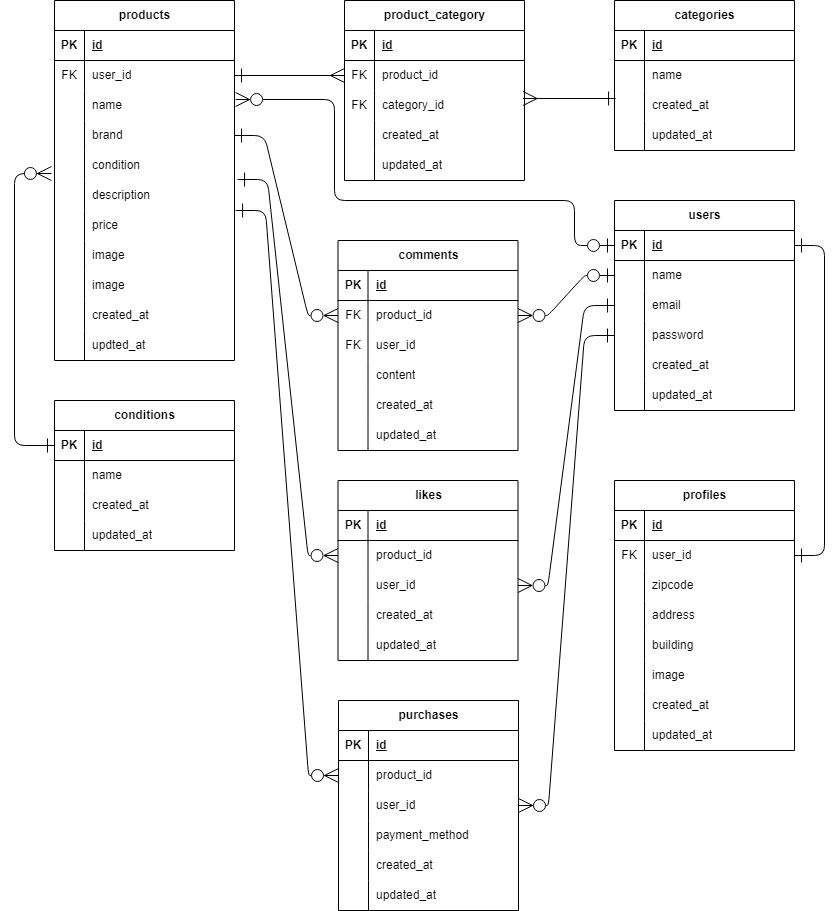

# フリーマーケット

## 環境構築
**Dockerビルド**
1. `git clone git@github.com:sano-san-dayo/freeMarket.git`
2. `cd freeMarket`
3. `docker-compose up -d --build`


**Laravel環境構築**
1. `docker-compose exec php bash`
2. `composer install`
3. `cp .env.example .env`
4. .envの下記変更  
　(変更前)  
　　DB_HOST=127.0.0.1  
　　DB_DATABASE=laravel  
　　DB_USERNAME=root  
　　DB_PASSWORD=  
　　MAIL_HOST=mailhog  
　　MAIL_FROM_ADDRESS=null  
　(変更後)  
　　DB_HOST=mysql  
　　DB_DATABASE=laravel_db  
　　DB_USERNAME=laravel_user  
　　DB_PASSWORD=laravel_pass  
　　MAIL_HOST=mail  
　　MAIL_FROM_ADDRESS=info@example.com  
　(追加)  
　　最下行に下記を追加  
　　STRIPE_KEY=pk_test_51S35fN1xxq12cCbessvtTV750ocLD7UFtu7LQKY9QlP9btPxeEqXiy13Xn3D6O0oakBgwrssKAA9JXO2QrrLuapG00kkswt8Ql  
　　STRIPE_SECRET=sk_test_51S35fN1xxq12cCbeGCIslC0dJNpMDo0wOwJ8PmzzHPrNVhBRngwWxRImXCN1uDShBd8acDScMeZn7dliezNYdlfT003QirMb4J  


5. アプリケーションキーの作成  
``` bash
php artisan key:generate
```
6. マイグレーションの実行
``` bash
php artisan migrate
```
7. シーディングの実行
``` bash
php artisan db:seed
```
8. シンボリックリンク作成
``` bash
php artisan storage:link
```

※ブラウザで表示した際「The stream or file "/var/www/storage/logs/laravel.log" could not be opened in append mode: failed to open stream: Permission denied The exception occurred while attempting to log: The stream or file」  
　とのエラーが発生する場合は下記コマンドにてディレクトリの所有者を変更してください。  
``` bash
sudo chown -R www-data:www-data src/storage
```


## 使用技術(実行環境)
- PHP8.3.0
- Laravel8.83.27
- MySQL8.0.26

## ER図


## 登録済ユーザ
以下のユーザを登録済みです。
※全ユーザメール認証済。
| ユーザ名 | メールアドレス  | パスワード |
| ------- | -------------- | --------- |
| user01  | user01@foo.bar | 11111111  |
| user02  | user02@foo.bar | 11111111  |
| user03  | user03@foo.bar | 11111111  |
| user04  | user04@foo.bar | 11111111  |

## 商品一覧
| 商品名  | 価格 |ブランド名 |商品説明 | 画像 | コンディション | 出品者 | 購入者 |
| ------- | ---- | --------- | ------- | ---- | -------------- | ------ | -------|
| 腕時計 | 15,000 | Rolax | スタイリッシュなデザインのメンズ腕時計 | Armani+Mens+Clock.jpg | 良好 | user01 ||
| HDD | 5,000 | 西芝 | 高速で信頼性の高いハードディスク | HDD+Hard+Disk.jpg | 目立った傷や汚れなし | user03 | user01 |
| 玉ねぎ3束 | 300 | なし | 新鮮な玉ねぎ3束のセット | iLoveIMG+d.jpg | やや傷や汚れあり | user02 | |
| 革靴 | 4,000 | | クラシックなデザインの革靴 | Leather+Shoes+Product+Photo.jpg | 状態が悪い | user03 | |
| ノートPC | 45,000 | | 高性能なノートパソコン | Living+Room+Laptop.jpg | 良好 | user01 | |
| マイク | 8,000 | なし | 高音質のレコーディング用マイク | Music+Mic+4632231.jpg | 目立った傷や汚れなし | user01 | |
| ショルダーバッグ | 3,500 | | おしゃれなショルダーバッグ | Purse+fashion+pocket.jpg | やや傷や汚れあり | user03 | |
| タンブラー | 500 | なし | 使いやすいタンブラー | Tumbler+souvenir.jpg | 状態が悪い | user04 | |
| コーヒーミル | 4,000 | Starbacks | 手動のコーヒーミル | Waitress+with+Coffee+Grinder.jpg | 良好 | user04 | |
| メイクセット | 2,500 | | 便利なメイクアップセット | 外出メイクアップセット.jpg | 目立った傷や汚れなし | user02 | |


## URL
- 開発環境：http://localhost/
- phpMyAdmin:：http://localhost:8080/
